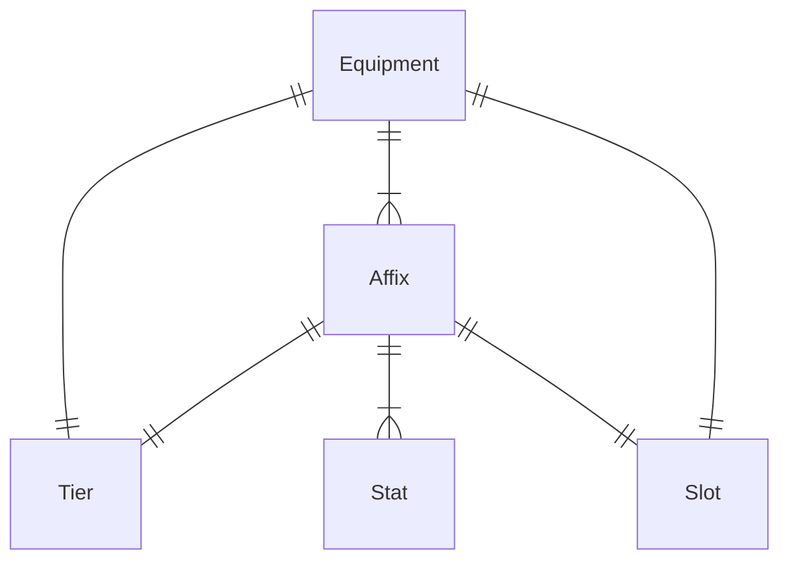

## 领域模型

### Equipment
| Field | Type | Description |
| :-- | :-- | :-- |
| name | string | 装备名称 |
| type | enum | 装备类型，见下方列表 |
| quality | enum | 装备品质，见下方列表 |
| tier | Tier | 装备所处的层级 |
| slot | Slot | 装备槽/类 |
| affixes | array | 装备的词缀 |
| material | Material | 装备材质 |

Type:
- armor: 护甲
- weapon: 武器 
- accessory: 饰品

Quality:
- blank: 白板 
- fine
- superior
- exquisite
- pristine

### Tier
| Field | Type | Description |
| :-- | :-- | :-- |
| name | string | 层级名称 |
| color | string | 层级颜色 |

### Slot
| Field | Type | Description |
| :-- | :-- | :-- |
| name | string | 槽名称 |
| number | number | 槽编号 |

### Affix
| Field | Type | Description |
| :-- | :-- | :-- |
| name | string | 词缀名称 |
| type | enum | 词缀类型，见下方列表 |
| tier | Tier | 所对应的层级 |
| slot | Slot | 所对应的槽 |
| stats | array | 词缀的数值 |

Type:
- prefix: 前缀
- suffix: 后缀

### Stat
| Field | Type | Description |
| :-- | :-- | :-- |
| name | string | 数值名称 |
| amount | number | 数值大小 |

## 参考资料 
- [Dreadmyst FAQ + Game Info](https://docs.google.com/spreadsheets/d/1GxuInbx8yLYp4mnmaHgCMmRkSamrE_cBCYlzvg1pCqM/edit?gid=2094395961#gid=2094395961)
- [DreadmystDB - Affixes](https://dreadmystdb.com/database/affixes)

